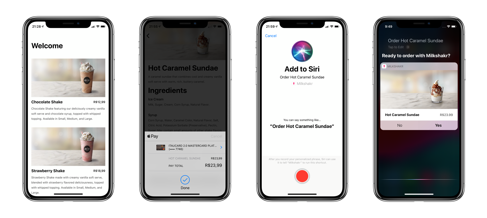

# Milkshakr

### A sample implementation of `NSUserActivity`, custom intent and extensions for Siri shortcuts

This project is the demo for my talk on Siri shortcuts. It implements a simple milkshake-ordering app that allows you to add a Siri shortcut for a previous order.

The app also implements intents and intents UI extensions so you can finish a purchase using Siri without having to launch the app.

Notes and known issues:

- There are layout issues on iOS devices other than iPhone X